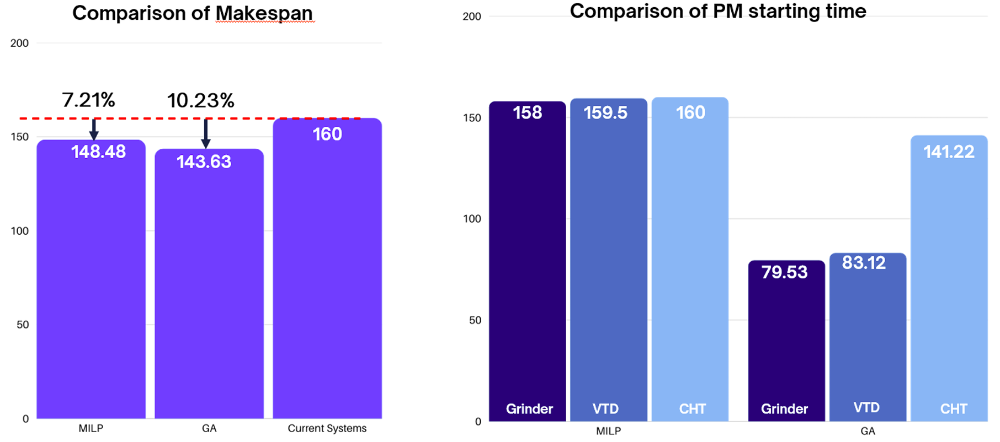

# Joint-Optimization-of-Production-Scheduling-Preventive-Maintenance
## Project Overview
This project addresses the complex scheduling challenge at the Deposition - Thermal area of Solar Technology. The goal is to minimize the total Makespan by synchronizing production schedules with Preventive Maintenance (PM) tasks for sequential machines (Grinder, VTD, and CHT).  
By integrating PM into the production flow, the model reduces machine downtime and eliminates bottlenecks, particularly at the CHT (Continuous Heat Treatment) station.
## Technical Highlights
- Hybrid approach: Leverages Mixed-Integer Linear Programming (MILP) for exact solutions in small-scale scenarios and Genetic Algorithm (GA) for large-scale, complex optimization.
- Algorithm efficiency: The GA was custom-built to handle complex constraints, including machine availability, PM frequency, and sequential processing times.
- Sensitivity analysis: Conducted to identify critical factors impacting the system's throughput, finding that PM duration at the CHT machine has the highest impact (14.16%).
## Tech Stack
- Language: Python 3.13
- Libraries:
  + `PuLP`: For MILP modeling and solving.
  + `Pandas` & `NumPy`: For data manipulation and processing.
  + `Matplotlib`: For visualizing optimization results and Gantt charts.
## Methodologies & Key results
**1. Mathematical formulation**
- Objective function: Minimize the makespan of the last job.
- Constraints:
  + Sequential processing
  + No-overlap production
  + Fixed PM intervals

**2. GA performance**
Executing over 1000 generations to find the near-optimal schedule:
- Initial Makespan: 149.48 hours
- Optimized Makespan: 141.22 hours
- Improvement: 5.5% reduction in total production time.  

**3. Optimization results**  
Our hybrid MILP-GA model significantly improved the production flow:  
- **Baseline Makespan**: 149.48 hours  
- **Optimized Makespan**: 141.22 hours (~5.5% improvement) [cite: 848]  

  

